# 2026-05-04-ia-as-cognitive-infrastructure

```mermaid
flowchart TD
  N0["IA"]
  N1["Cognitive Infrastructure"]
  N2["diagramming practices"]
  N3["evidence-aligned"]
  N4["cognitive load"]
  N5["hidden structure"]
  N6["explicit relations"]
  N7["common ground"]
  N8["disagreement inspectable"]
  N9["information architecture"]
  N10["cognitive infrastructure"]
  N11["cost of forming mental models"]
  N12["cost of testing mental models"]
  N13["cost of sharing mental models"]
  N14["cost of revising mental models"]
  N15["what people can notice"]
  N16["what people can compare"]
  N17["what people can discuss"]
  N18["what people can decide"]
  N19["what people can operate"]
  N20["what people can remember"]
  N21["Good IA"]
  N22["people reason together under constraints"]
  N23["reduce cognitive load"]
  N24["externalize hidden structure"]
  N25["force explicit relationships"]
  N26["support common ground across roles"]
  N27["make disagreement inspectable"]
  N28["preserve context across time"]
  N29["connect information to decisions and action"]
  N30["findability"]
  N31["Findability"]
  N32["one function"]
  N33["Model alignment"]
  N34["higher-value function"]
  N35["operational and engineering contexts"]
  N36["IA for finding"]
  N37["Where is the thing?"]
  N38["What is it called?"]
  N39["Which category contains it?"]
  N40["How do I navigate to it?"]
  N41["IA for reasoning"]
  N42["What depends on what?"]
  N43["What causes what?"]
  N44["What changes state?"]
  N45["What evidence supports this claim?"]
  N46["What assumptions are being made?"]
  N47["IA for coordination"]
  N48["Who owns this?"]
  N49["Who needs to know?"]
  N50["What action follows?"]
  N51["What changes during an incident?"]
  N52["What context must survive handoff?"]
  N53["Artifact"]
  N54["all three types of IA"]
  N55["Confusing IA types"]
  N56["weak designs"]
  N57["Taxonomy optimized for lookup"]
  N58["causality"]
  N59["Architecture diagram"]
  N60["ownership"]
  N61["Runbook"]
  N62["steps"]
  N63["mental model"]
  N64["weak service catalog"]
  N65["inventory"]
  N66["stronger service catalog"]
  N67["shared operational model"]
  N68["services"]
  N69["owners"]
  N70["dependencies"]
  N71["SLOs"]
  N72["escalation paths"]
  N73["failure modes"]
  N74["dashboards"]
  N75["alerts"]
  N76["runbooks"]
  N77["operational maturity"]
  N78["incidents"]
  N79["onboarding"]
  N80["architecture review"]
  N81["dependency migration"]
  N82["ownership cleanup"]
  N83["postmortem follow-up"]
  N84["operational reasoning cheaper"]
  N85["operational reasoning less dependent on tribal memory"]
  N86["diagramming"]
  N87["external representation"]
  N88["diagramming and IA"]
  N89["important relationships explicit"]
  N90["search effort"]
  N91["gaps or contradictions"]
  N92["a shared object of discussion"]
  N93["later reconstruction of the reasoning"]
  N94["diagrams"]
  N95["cognitive artifacts"]
  N96["maps"]
  N0 -- "is" --> N1
  N2 -- "are" --> N3
  N2 -- "reduce" --> N4
  N2 -- "externalize" --> N5
  N2 -- "force" --> N6
  N2 -- "support" --> N7
  N2 -- "make" --> N8
  N9 -- "should do" --> N2
  N0 -- "is" --> N10
  N0 -- "reduces" --> N11
  N0 -- "reduces" --> N12
  N0 -- "reduces" --> N13
  N0 -- "reduces" --> N14
  N0 -- "shapes" --> N15
  N0 -- "shapes" --> N16
  N0 -- "shapes" --> N17
  N0 -- "shapes" --> N18
  N0 -- "shapes" --> N19
  N0 -- "shapes" --> N20
  N21 -- "helps" --> N22
  N21 -- "should" --> N23
  N21 -- "should" --> N24
  N21 -- "should" --> N25
  N21 -- "should" --> N26
  N21 -- "should" --> N27
  N21 -- "should" --> N28
  N21 -- "should" --> N29
  N0 -- "is broader than" --> N30
  N31 -- "is" --> N32
  N33 -- "is" --> N34
  N33 -- "occurs in" --> N35
  N36 -- "answers" --> N37
  N36 -- "answers" --> N38
  N36 -- "answers" --> N39
  N36 -- "answers" --> N40
  N41 -- "answers" --> N42
  N41 -- "answers" --> N43
  N41 -- "answers" --> N44
  N41 -- "answers" --> N45
  N41 -- "answers" --> N46
  N47 -- "answers" --> N48
  N47 -- "answers" --> N49
  N47 -- "answers" --> N50
  N47 -- "answers" --> N51
  N47 -- "answers" --> N52
  N53 -- "can serve" --> N54
  N55 -- "produces" --> N56
  N57 -- "may not explain" --> N58
  N59 -- "may not reveal" --> N60
  N61 -- "may list" --> N62
  N61 -- "may not preserve" --> N63
  N64 -- "is" --> N65
  N66 -- "is" --> N67
  N66 -- "captures" --> N68
  N66 -- "captures" --> N69
  N66 -- "captures" --> N70
  N66 -- "captures" --> N71
  N66 -- "captures" --> N72
  N66 -- "captures" --> N73
  N66 -- "captures" --> N74
  N66 -- "captures" --> N75
  N66 -- "captures" --> N76
  N66 -- "captures" --> N77
  N66 -- "useful during" --> N78
  N66 -- "useful during" --> N79
  N66 -- "useful during" --> N80
  N66 -- "useful during" --> N81
  N66 -- "useful during" --> N82
  N66 -- "useful during" --> N83
  N66 -- "makes" --> N84
  N66 -- "makes" --> N85
  N86 -- "is a form of" --> N87
  N0 -- "is a form of" --> N87
  N88 -- "make" --> N89
  N88 -- "reduce" --> N90
  N88 -- "expose" --> N91
  N88 -- "create" --> N92
  N88 -- "allow" --> N93
  N94 -- "belong to" --> N95
  N96 -- "belong to" --> N95
```

## Triples

| Subject | Relation | Object |
| --- | --- | --- |
| IA | is | Cognitive Infrastructure |
| diagramming practices | are | evidence-aligned |
| diagramming practices | reduce | cognitive load |
| diagramming practices | externalize | hidden structure |
| diagramming practices | force | explicit relations |
| diagramming practices | support | common ground |
| diagramming practices | make | disagreement inspectable |
| information architecture | should do | diagramming practices |
| IA | is | cognitive infrastructure |
| IA | reduces | cost of forming mental models |
| IA | reduces | cost of testing mental models |
| IA | reduces | cost of sharing mental models |
| IA | reduces | cost of revising mental models |
| IA | shapes | what people can notice |
| IA | shapes | what people can compare |
| IA | shapes | what people can discuss |
| IA | shapes | what people can decide |
| IA | shapes | what people can operate |
| IA | shapes | what people can remember |
| Good IA | helps | people reason together under constraints |
| Good IA | should | reduce cognitive load |
| Good IA | should | externalize hidden structure |
| Good IA | should | force explicit relationships |
| Good IA | should | support common ground across roles |
| Good IA | should | make disagreement inspectable |
| Good IA | should | preserve context across time |
| Good IA | should | connect information to decisions and action |
| IA | is broader than | findability |
| Findability | is | one function |
| Model alignment | is | higher-value function |
| Model alignment | occurs in | operational and engineering contexts |
| IA for finding | answers | Where is the thing? |
| IA for finding | answers | What is it called? |
| IA for finding | answers | Which category contains it? |
| IA for finding | answers | How do I navigate to it? |
| IA for reasoning | answers | What depends on what? |
| IA for reasoning | answers | What causes what? |
| IA for reasoning | answers | What changes state? |
| IA for reasoning | answers | What evidence supports this claim? |
| IA for reasoning | answers | What assumptions are being made? |
| IA for coordination | answers | Who owns this? |
| IA for coordination | answers | Who needs to know? |
| IA for coordination | answers | What action follows? |
| IA for coordination | answers | What changes during an incident? |
| IA for coordination | answers | What context must survive handoff? |
| Artifact | can serve | all three types of IA |
| Confusing IA types | produces | weak designs |
| Taxonomy optimized for lookup | may not explain | causality |
| Architecture diagram | may not reveal | ownership |
| Runbook | may list | steps |
| Runbook | may not preserve | mental model |
| weak service catalog | is | inventory |
| stronger service catalog | is | shared operational model |
| stronger service catalog | captures | services |
| stronger service catalog | captures | owners |
| stronger service catalog | captures | dependencies |
| stronger service catalog | captures | SLOs |
| stronger service catalog | captures | escalation paths |
| stronger service catalog | captures | failure modes |
| stronger service catalog | captures | dashboards |
| stronger service catalog | captures | alerts |
| stronger service catalog | captures | runbooks |
| stronger service catalog | captures | operational maturity |
| stronger service catalog | useful during | incidents |
| stronger service catalog | useful during | onboarding |
| stronger service catalog | useful during | architecture review |
| stronger service catalog | useful during | dependency migration |
| stronger service catalog | useful during | ownership cleanup |
| stronger service catalog | useful during | postmortem follow-up |
| stronger service catalog | makes | operational reasoning cheaper |
| stronger service catalog | makes | operational reasoning less dependent on tribal memory |
| diagramming | is a form of | external representation |
| IA | is a form of | external representation |
| diagramming and IA | make | important relationships explicit |
| diagramming and IA | reduce | search effort |
| diagramming and IA | expose | gaps or contradictions |
| diagramming and IA | create | a shared object of discussion |
| diagramming and IA | allow | later reconstruction of the reasoning |
| diagrams | belong to | cognitive artifacts |
| maps | belong to | cognitive artifacts |