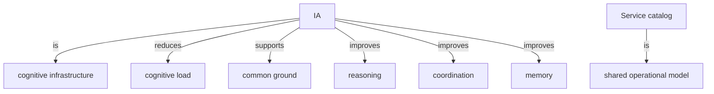

# 2026-05-04-ia-as-cognitive-infrastructure

## Triples

| Subject | Relation | Object |
| --- | --- | --- |
| IA | is | cognitive infrastructure |
| IA | reduces | cognitive load |
| IA | supports | common ground |
| IA | improves | reasoning |
| IA | improves | coordination |
| IA | improves | memory |
| Service catalog | is | shared operational model |