# combat_system_reference

```mermaid
flowchart TD
  N0["This file"]
  N1["Markdown conversion"]
  N2["reference material"]
  N3["Reference material"]
  N4["combat-action planning"]
  N5["Simulator behavior"]
  N6["doc/requirements.md"]
  N7["Battles"]
  N8["rectangular battlefields"]
  N9["Battlefields"]
  N10["individual hex spaces"]
  N11["Unit stacks"]
  N12["hex spaces"]
  N13["Army"]
  N14["one side"]
  N15["Enemy army"]
  N16["opposite side"]
  N17["Objects"]
  N18["battlefield"]
  N19["Hex spaces"]
  N20["unit stacks"]
  N21["Obstacles"]
  N22["choke points"]
  N23["Choke points"]
  N24["enemy units"]
  N25["natural walls"]
  N26["Natural walls"]
  N27["ranged units"]
  N28["Ranged units"]
  N29["enemy melee units"]
  N30["Defender's city walls"]
  N31["half of the battlefield"]
  N32["City walls"]
  N33["before becoming passable"]
  N34["Ground troops"]
  N35["city walls"]
  N36["Combat"]
  N37["rounds"]
  N38["moving across the battlefield"]
  N39["attacking enemy units"]
  N40["Round"]
  N41["when all units have acted"]
  N42["Icons"]
  N43["creature stacks"]
  N44["turn order"]
  N45["Turn order"]
  N46["initiative and speed values"]
  N47["Initiative"]
  N48["how soon a creature can act"]
  N49["Speed"]
  N50["how far a creature can move"]
  N51["Tie in initiative"]
  N52["higher speed value"]
  N53["Equal initiative and speed"]
  N54["turn order to shift back and forth"]
  N55["Allied troops"]
  N56["hero's army slots"]
  N57["Hero's army slots"]
  N58["from left to right"]
  N59["First round tie break"]
  N60["attacker"]
  N61["Odd numbered rounds"]
  N62["Even numbered rounds"]
  N63["defenders"]
  N64["Game"]
  N65["equal opportunity to act"]
  N66["Death of Griffins"]
  N67["round order"]
  N68["Wait"]
  N69["Skip Turn"]
  N70["unit's action"]
  N71["end of the turn order"]
  N72["unit's initiative"]
  N73["lower initiative units to take turn first"]
  N74["unit's turn"]
  N75["no action"]
  N76["no movement"]
  N77["weaker units"]
  N78["attacking powerful enemy stack"]
  N79["retaliation"]
  N80["small stack of weak unit"]
  N81["enemy ranged unit from shooting"]
  N82["small stacks of weaker creatures"]
  N83["enemy actions"]
  N84["Units"]
  N85["three basic attack types"]
  N86["Melee Attacks"]
  N87["units in adjacent hexes"]
  N88["counterattack"]
  N89["Long Reach Attacks"]
  N90["enemy units exactly one hex away"]
  N91["Units with Long Reach attacks"]
  N92["melee"]
  N93["Ranged Attacks"]
  N94["any enemy on the battlefield"]
  N95["enemy in adjacent hex"]
  N96["reduced damage"]
  N97["Reduced damage"]
  N98["target is more than three hexes away"]
  N99["Damage"]
  N100["10% per additional hex"]
  N101["Damage reduction"]
  N102["50%"]
  N103["creature"]
  N104["another creature"]
  N105["damage inflicted"]
  N106["attacker's Attack value"]
  N107["defender's Defense value"]
  N108["hero's Attack"]
  N109["creatures under command's Attack"]
  N110["hero's Defense"]
  N111["creatures under command's Defense"]
  N112["damage"]
  N113["(1 + 5% * attacker's ATK"]
  N114["(1 + 5% * defender's DEF"]
  N115["if over .5"]
  N116["if under .5"]
  N117["damage modifier formula"]
  N118["((1 + 5% * ATK"]
  N119["Attack modifiers"]
  N120["resulting damage"]
  N121["Basic Modifier"]
  N122["(20 + ATK"]
  N123["Basic Modifier + Offense skill"]
  N124["BASIC MODIFIER * [1.15; 1.20; 1.25]"]
  N125["Basic Modifier + defending creature has Defense skill"]
  N126["BASIC MODIFIER * [0.85; 0.80; 0.75]"]
  N127["Overall Formula for Damage Calculations"]
  N128["Tag-based damage"]
  N129["differently than all-type damage"]
  N0 -- "is a" --> N1
  N0 -- "is a" --> N2
  N3 -- "is for" --> N4
  N5 -- "belongs in" --> N6
  N7 -- "take place on" --> N8
  N9 -- "consist of" --> N10
  N11 -- "can occupy" --> N12
  N13 -- "is positioned on" --> N14
  N15 -- "is positioned on" --> N16
  N17 -- "are strewn about" --> N18
  N17 -- "represent" --> N12
  N19 -- "may not be occupied by" --> N20
  N21 -- "can act as" --> N22
  N23 -- "funnel" --> N24
  N21 -- "can act as" --> N25
  N26 -- "protect" --> N27
  N28 -- "protect themselves from" --> N29
  N30 -- "take up" --> N31
  N32 -- "must be destroyed" --> N33
  N34 -- "can pass through" --> N35
  N36 -- "is divided into" --> N37
  N11 -- "take turns" --> N38
  N11 -- "take turns" --> N39
  N40 -- "ends" --> N41
  N42 -- "represent" --> N43
  N42 -- "represent" --> N44
  N45 -- "is determined by" --> N46
  N47 -- "determines" --> N48
  N49 -- "indicates" --> N50
  N51 -- "gives priority to" --> N52
  N53 -- "causes" --> N54
  N55 -- "sorted by" --> N56
  N57 -- "sorted" --> N58
  N59 -- "goes to" --> N60
  N61 -- "give priority to" --> N60
  N62 -- "give priority to" --> N63
  N64 -- "tries to give" --> N65
  N66 -- "changes" --> N67
  N20 -- "have options" --> N68
  N20 -- "have options" --> N69
  N68 -- "pushes" --> N70
  N68 -- "pushes action to" --> N71
  N68 -- "flips" --> N72
  N68 -- "allows" --> N73
  N69 -- "ends" --> N74
  N69 -- "involves" --> N75
  N69 -- "involves" --> N76
  N77 -- "avoid" --> N78
  N79 -- "hurts" --> N77
  N80 -- "prevents" --> N81
  N82 -- "block" --> N27
  N82 -- "waste" --> N83
  N84 -- "can use" --> N85
  N86 -- "used against" --> N87
  N86 -- "will trigger" --> N88
  N89 -- "target" --> N90
  N89 -- "do not provoke" --> N88
  N91 -- "can engage in" --> N92
  N93 -- "can target" --> N94
  N93 -- "cannot target" --> N95
  N93 -- "deal" --> N96
  N97 -- "occurs if" --> N98
  N99 -- "decreases by" --> N100
  N101 -- "has a maximum of" --> N102
  N103 -- "attacks" --> N104
  N105 -- "increased by" --> N106
  N105 -- "reduced by" --> N107
  N108 -- "added to" --> N109
  N110 -- "added to" --> N111
  N112 -- "multiplied by" --> N113
  N112 -- "divided by" --> N114
  N112 -- "rounded up" --> N115
  N112 -- "rounded down" --> N116
  N117 -- "equals" --> N118
  N119 -- "impact" --> N120
  N121 -- "equals" --> N122
  N123 -- "equals" --> N124
  N125 -- "equals" --> N126
  N127 -- "equals" --> N122
  N128 -- "are grouped" --> N129
```

## Triples

| Subject | Relation | Object |
| --- | --- | --- |
| This file | is a | Markdown conversion |
| This file | is a | reference material |
| Reference material | is for | combat-action planning |
| Simulator behavior | belongs in | doc/requirements.md |
| Battles | take place on | rectangular battlefields |
| Battlefields | consist of | individual hex spaces |
| Unit stacks | can occupy | hex spaces |
| Army | is positioned on | one side |
| Enemy army | is positioned on | opposite side |
| Objects | are strewn about | battlefield |
| Objects | represent | hex spaces |
| Hex spaces | may not be occupied by | unit stacks |
| Obstacles | can act as | choke points |
| Choke points | funnel | enemy units |
| Obstacles | can act as | natural walls |
| Natural walls | protect | ranged units |
| Ranged units | protect themselves from | enemy melee units |
| Defender's city walls | take up | half of the battlefield |
| City walls | must be destroyed | before becoming passable |
| Ground troops | can pass through | city walls |
| Combat | is divided into | rounds |
| Unit stacks | take turns | moving across the battlefield |
| Unit stacks | take turns | attacking enemy units |
| Round | ends | when all units have acted |
| Icons | represent | creature stacks |
| Icons | represent | turn order |
| Turn order | is determined by | initiative and speed values |
| Initiative | determines | how soon a creature can act |
| Speed | indicates | how far a creature can move |
| Tie in initiative | gives priority to | higher speed value |
| Equal initiative and speed | causes | turn order to shift back and forth |
| Allied troops | sorted by | hero's army slots |
| Hero's army slots | sorted | from left to right |
| First round tie break | goes to | attacker |
| Odd numbered rounds | give priority to | attacker |
| Even numbered rounds | give priority to | defenders |
| Game | tries to give | equal opportunity to act |
| Death of Griffins | changes | round order |
| unit stacks | have options | Wait |
| unit stacks | have options | Skip Turn |
| Wait | pushes | unit's action |
| Wait | pushes action to | end of the turn order |
| Wait | flips | unit's initiative |
| Wait | allows | lower initiative units to take turn first |
| Skip Turn | ends | unit's turn |
| Skip Turn | involves | no action |
| Skip Turn | involves | no movement |
| weaker units | avoid | attacking powerful enemy stack |
| retaliation | hurts | weaker units |
| small stack of weak unit | prevents | enemy ranged unit from shooting |
| small stacks of weaker creatures | block | ranged units |
| small stacks of weaker creatures | waste | enemy actions |
| Units | can use | three basic attack types |
| Melee Attacks | used against | units in adjacent hexes |
| Melee Attacks | will trigger | counterattack |
| Long Reach Attacks | target | enemy units exactly one hex away |
| Long Reach Attacks | do not provoke | counterattack |
| Units with Long Reach attacks | can engage in | melee |
| Ranged Attacks | can target | any enemy on the battlefield |
| Ranged Attacks | cannot target | enemy in adjacent hex |
| Ranged Attacks | deal | reduced damage |
| Reduced damage | occurs if | target is more than three hexes away |
| Damage | decreases by | 10% per additional hex |
| Damage reduction | has a maximum of | 50% |
| creature | attacks | another creature |
| damage inflicted | increased by | attacker's Attack value |
| damage inflicted | reduced by | defender's Defense value |
| hero's Attack | added to | creatures under command's Attack |
| hero's Defense | added to | creatures under command's Defense |
| damage | multiplied by | (1 + 5% * attacker's ATK |
| damage | divided by | (1 + 5% * defender's DEF |
| damage | rounded up | if over .5 |
| damage | rounded down | if under .5 |
| damage modifier formula | equals | ((1 + 5% * ATK |
| Attack modifiers | impact | resulting damage |
| Basic Modifier | equals | (20 + ATK |
| Basic Modifier + Offense skill | equals | BASIC MODIFIER * [1.15; 1.20; 1.25] |
| Basic Modifier + defending creature has Defense skill | equals | BASIC MODIFIER * [0.85; 0.80; 0.75] |
| Overall Formula for Damage Calculations | equals | (20 + ATK |
| Tag-based damage | are grouped | differently than all-type damage |